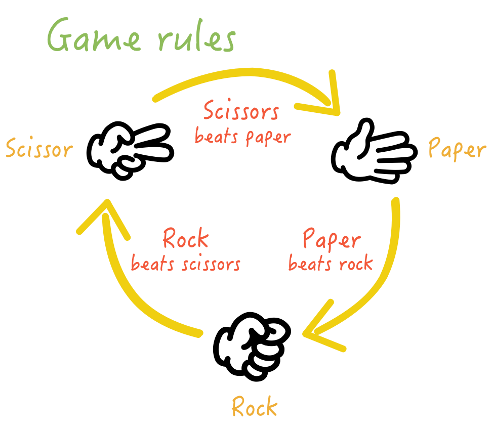

# Rock Paper Scissors

###Choose your weapon and throwdown against the computer! You Each have 5 Lives And once they are gone YOU DIE!
####If you win 3 battles in a row, 1 life is restored.

###Programs Required: Python 3
####Clone the project, cd to your directory / download, and run the game.py file in a Python3 Terminal window for Mac / Linux, or the Powershell for Windows 

####The Rules are the same as the classic game:
1. Paper Covers Rock
2. Scissors Cuts Paper
3. Rock Smashes Scissors 

###Choose your weapon Wisely!

### Platform: Python 3 

##Let's see if you can beat that pesky computer!
